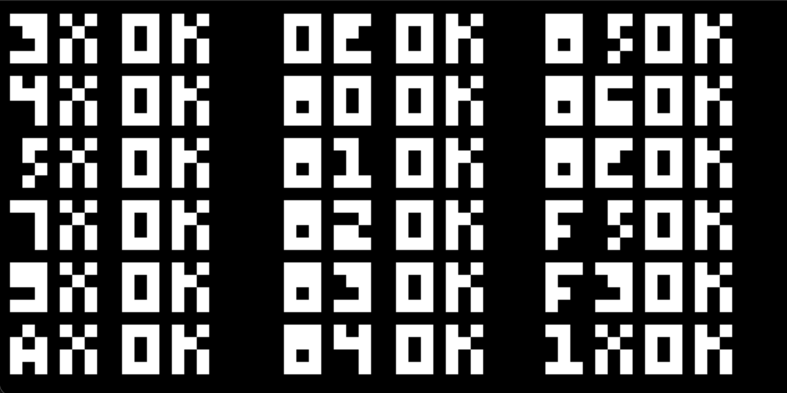
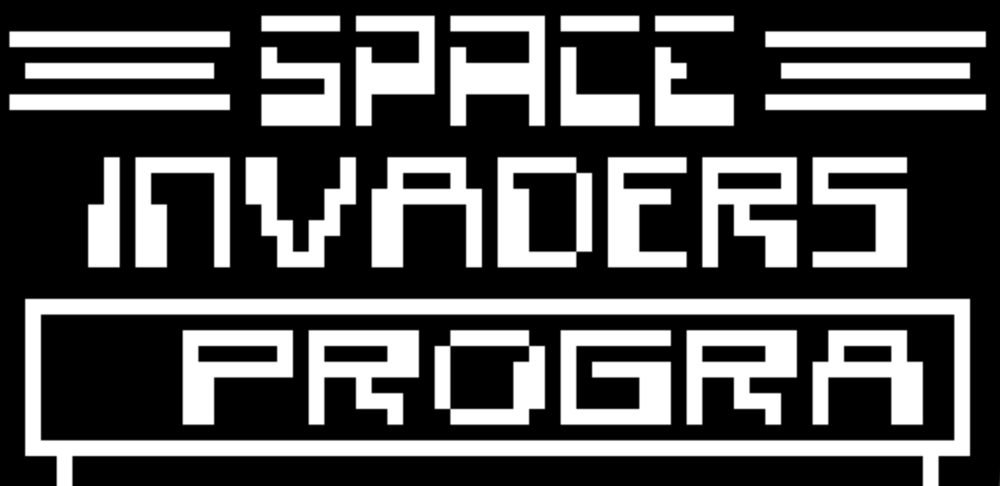

# CHIP-8 Emulator

| | | |
|---|---|---|
|  |  |  |

A small CHIP-8 emulator written in C++17 using SDL2 for graphics, keyboard
input, and audio.

## Features

- CHIP-8 instruction execution
- 64 × 32 monochrome display scaled to a 640 × 320 SDL window
- Hexadecimal keypad mapping
- 60 Hz delay and sound timers
- Simple SDL audio output
- ROM loading from the `games/` directory

## Requirements

- A C++17-compatible compiler
- GNU Make
- `pkg-config`
- SDL2 development files

### macOS

Install the dependencies with Homebrew:

```sh
brew install sdl2 pkg-config
```

### Ubuntu/Debian

```sh
sudo apt update
sudo apt install build-essential pkg-config libsdl2-dev
```

## Build and run

Build the emulator:

```sh
make build
```

Run the default ROM (`PONG`):

```sh
make run
```

Run another ROM from the `games/` directory:

```sh
make run GAME=TETRIS
```

You can also run the executable directly:

```sh
./chip8.out INVADERS
```

Remove the generated executable with:

```sh
make clean
```

## Controls

The original CHIP-8 keypad is mapped to the keyboard as follows:

```text
CHIP-8 keypad       Computer keyboard
1 2 3 C             1 2 3 4
4 5 6 D             Q W E R
7 8 9 E             A S D F
A 0 B F             Z X C V
```

Close the SDL window to stop the emulator.

## Project structure

```text
main.cpp      Application loop, SDL events, timing, and audio
chip8.cpp     CHIP-8 CPU, memory, opcodes, timers, and keypad state
screen.cpp    SDL window and renderer management
games/        CHIP-8 ROM files
assets/       Project screenshots
```

## Notes

This is a small educational emulator. CHIP-8 ROM compatibility can vary because
different interpreters use slightly different instruction behaviors, commonly
known as quirks.

## License

The emulator source code is available under the [MIT License](LICENSE).
Third-party ROMs and other external assets remain subject to their respective
licenses and copyrights.
